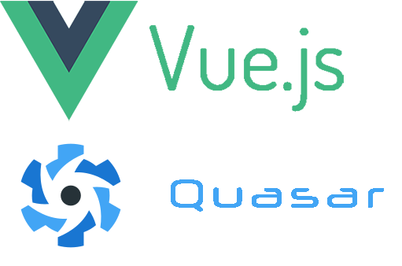
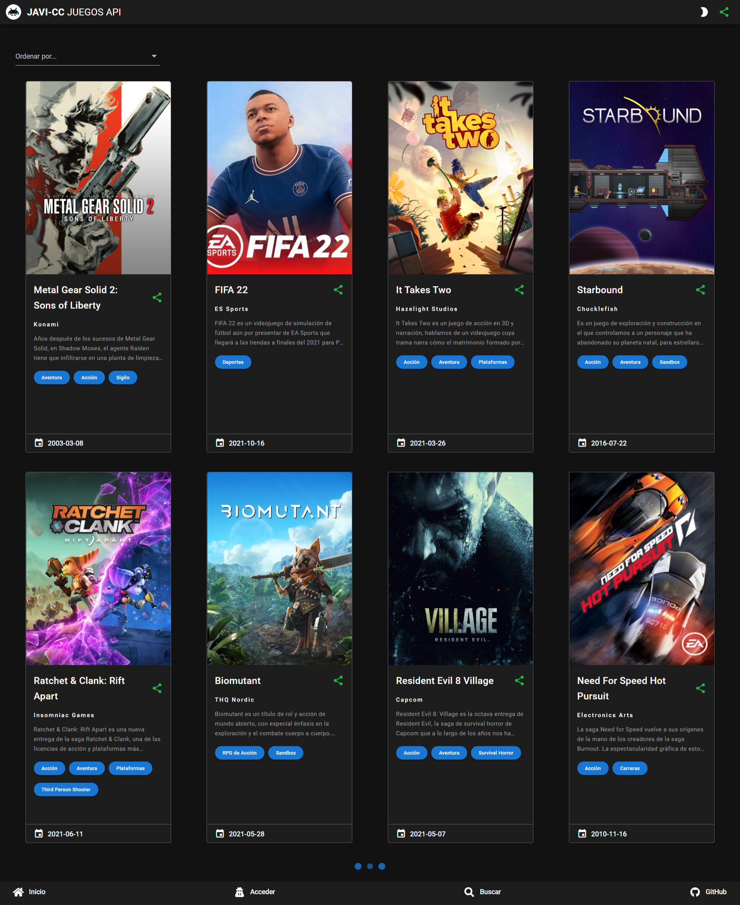
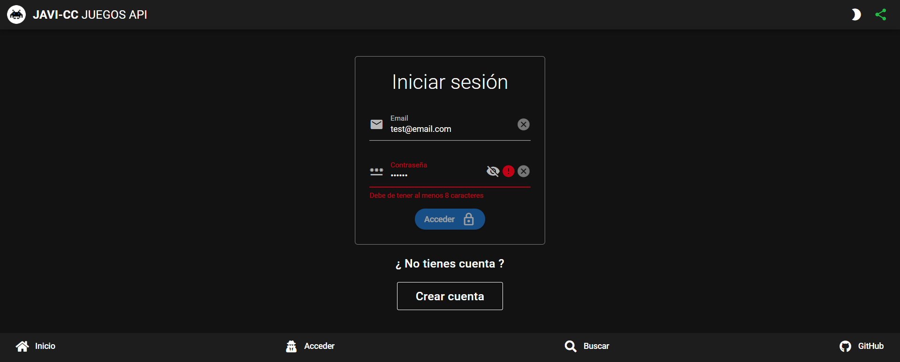
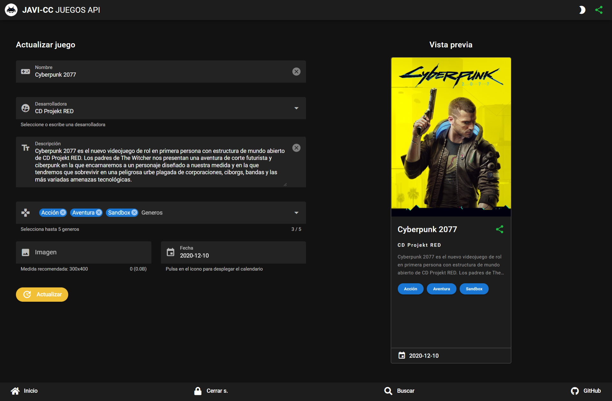
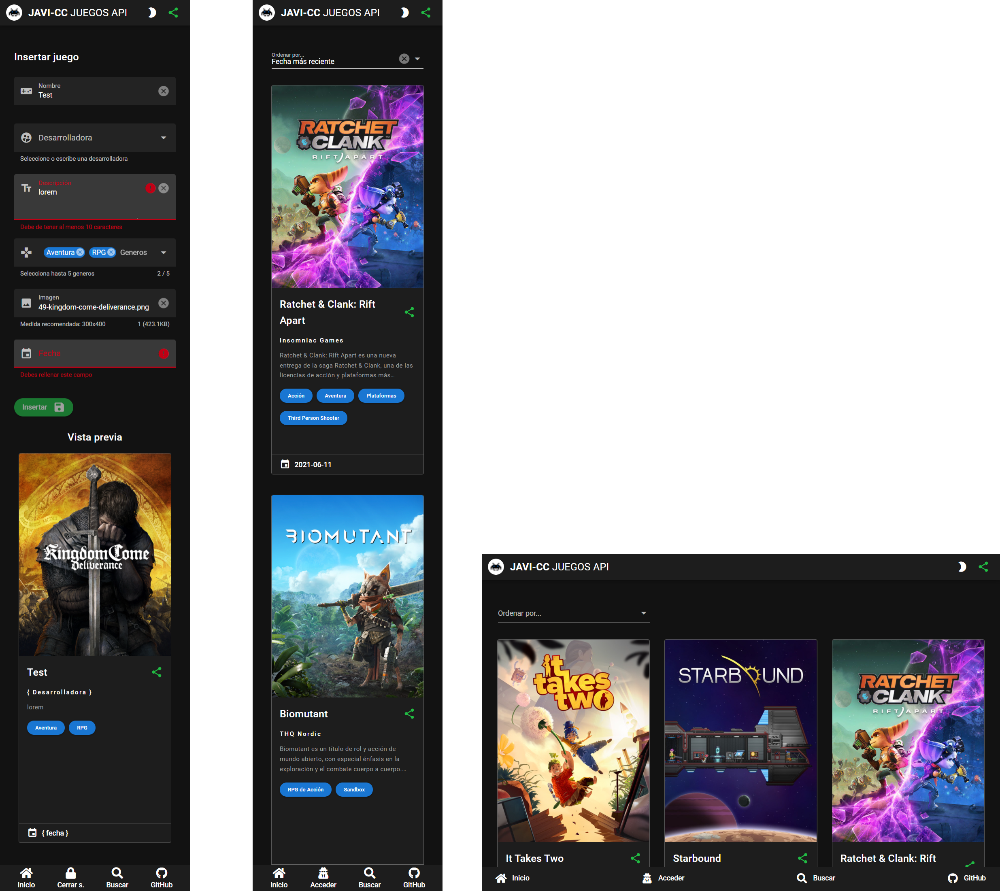

Application made with Vue 3 using Quasar Framework that contains responsive web interface, PWA and exported in APK using Apache Cordova and capacitor. The application is connected to an API made in Laravel.<a href="https://laraveljuegosapi.herokuapp.com/api/juegos" target="_blank"> https://laraveljuegosapi.herokuapp.com</a>

Application made with Vue 3 consists of the creation of a CRUD and authentication system that come from a games API and the development of styles using Quasar Framework. The application made with Vue 3 contains the following functionalities:

<ul>
<li>I use the Vue3 version with the composition API.</li>
<li>Style development with Quasar Framework.</li>
<li>VUEX.</li>
<li>AXIOS.</li>
<li>Keep-alive.</li>
<li>Vue-router.</li>
<li>PWA (Progressive Web Apps).</li>
<li>SPA (Single Page Application).</li>
<li>Application exported in APK using Apache Cordova.</li>
<li>Application exported in APK using Capacitor.</li>
<li>The project contains the files to implement it in Docker.</li>
<li>Vue-validate.</li>
<li>Helpers.</li>
<li>Watchers.</li>
<li>Props.</li>
<li>Slots.</li>
<li>Emits.</li>
<li>Websockets with Pusher.</li>
<li>Unit tests with JEST.</li>
<li>The application is connected to a games API made in Laravel: <a href="https://github.com/JAVI-CC/Laravel-API-Server" target="_blank">https://github.com/JAVI-CC/Laravel-API-Server</a></li>
</ul>

<h2>Demo</h2>
<a href="https://vue-api-client.vercel.app/" target="_blank">https://vue-api-client.vercel.app</a> 
User: admin@email.com 
Password: 12345678

<h2>Start the app in the development mode</h2>
<pre><code>$ yarn && quasar dev -m pwa</code></pre>

<h2>Start the app in the production mode</h2>
<pre><code>$ yarn && quasar build -m pwa</code></pre>

<h2>Export the app in APK apache cordova in the development mode</h2>
<pre><code>$ yarn && quasar dev -m cordova -T android</code></pre>

<h2>Export the app in APK apache cordova in the production mode</h2>
<pre><code>$ yarn && quasar build -m cordova -T android</code></pre>

<h2>Export the app in APK capactior in the production mode</h2>
<pre><code>$ yarn && quasar build -m capacitor -T android -d</code></pre>

<h2>Start the websockets with Pusher in the development mode (Optional)</h2>
<pre><code>1. In your <a href="https://pusher.com/" target="_blank">Pusher account</a> create a channel called: <strong>juegos-api</strong></code></pre>
<pre><code>2. Enter the file: <strong>development.env</strong></code></pre>
<pre><code>3. fill in the following credentials:
 <strong>PUSHER_APP_KEY=</strong>{App Keys in the channel juegos-api key}
 <strong>PUSHER_APP_CLUSTER=</strong>{App Keys in the channel juegos-api cluster}
</code></pre>

<h2>Start the websockets with Pusher in the production mode (Optional)</h2>
<pre><code>1. In your <a href="https://pusher.com/" target="_blank">Pusher account</a> create a channel called: <strong>juegos-api</strong></code></pre>
<pre><code>2. Enter the file: <strong>production.env</strong></code></pre>
<pre><code>3. fill in the following credentials:
 <strong>PUSHER_APP_KEY=</strong>{App Keys in the channel juegos-api key}
 <strong>PUSHER_APP_CLUSTER=</strong>{App Keys in the channel juegos-api cluster}
</code></pre>

<h2>Start Jest unit tests</h2>
<pre><code>$ yarn && [ yarn test:unit || quasar test --unit jest ]</code></pre>

<h2>Start Cypress end to end tests</h2>
<pre><code>$ yarn && yarn cypress:open</code></pre>

<h3>Show get all registries API SERVER:</h3>

<h3>Login form:</h3>

<h3>Create or update registrer sending it to the API SERVER:</h3>

<h3>Application web responsive:</h3>

<h2>Deploy to Docker <g-emoji class="g-emoji" alias="whale" fallback-src="https://github.githubassets.com/images/icons/emoji/unicode/1f433.png">🐳</g-emoji></h2>

<h4>Setup:</h4>
<pre>
<code>$ git clone https://github.com/JAVI-CC/VUE3-API-client.git
$ cd VUE3-API-client
$ docker-compose up -d --build</code>
</pre>

Once you have the containers deployed, you can access the APP at  <a href="http://localhost:8080" target="_blank">http://localhost:8080</a>
